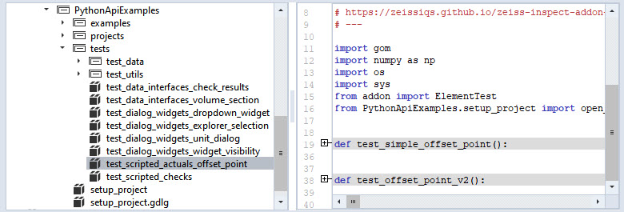

# Testing add-ons

```{note}
You can use the `Python API Examples` add-on, which you can find in the store, as an example how to include tests in your add-on.
```
## Why testing?

Testing your add-on is a crucial step for maintainability, especially when dealing with multiple software versions or updates. As manually testing your add-on is often tedious and time consuming, this how-to focuses on how to include **automated tests** in your add-on.

Automated tests are important when writing add-ons in Python because they help to ensure the code is running correctly and efficiently. Furthermore, they can be used to ensure that the code is compatible with different versions of the GOM Software, as well as on different machines. Finally, automated tests can be used to improve the overall performance of the add-on, as well as to ensure it meets the user’s requirements.

## File structure

```{note}
The following structure is currently **recommended** and should serve you as a best-practice example. In upcoming SW-Versions, this structure might become **mandatory** for automatic test discovery to work.
```

The file and folder structure of add-on tests is similar to the *pyTest*s [Conventions for Python test discovery](https://docs.pytest.org/en/7.2.x/explanation/goodpractices.html#conventions-for-python-test-discovery). We recommend:

* put all python test scripts in a **separate `tests` directory** of your add-ons top-level directory.
* name test scripts **starting with `test_`** and contain **functions with the prexix `test_`**. 

   

You may additionally include a script at the top-level that executes all of your tests (`run_tests.py` in the screenshot).

## Writing a test script

The following steps are required to write a new test script. The example code is taken from the `Python API Examples` add-on, which you can find in the store.

1. Create a test script: Create a Python file with the convention test_*.py. 
   (Example: `PythonApiExamples/tests/test_data_interfaces_check_results`)
   
2. Import the module or package to be tested: Import the module or package that you want to test.

   ```python
   # Importing the example we want to test
   import PythonApiExamples.examples.data_interfaces.check_results_data_array as example
   ```
   
   For this to work properly, the code that you want to test needs to be structured in functions as well. In this case, there are several functions in the `check_results_data_arrray` script, like `get_single_result_value()`, which will be called later (see step 3).
   For more details, see also: [How the examples are structured](../../python_examples/index.md#how-the-examples-are-structured).
   
3. Write test functions: Write test functions named with prefix `test_` that define expected behavior.

   ```python
   def test_check_results ():
     # Setup test project
     open_project('gom_part_test_project')
     test_element = gom.app.project.inspection['Surface comparison 1']
     
     # Test definition
     expected_single_value = 2.0495047569274902
     actual_result_value = example.get_single_result_value(test_element)
     
     assert actual_result_value == expected_single_value
   ```

4. Define which tests to run when the script itself is executed. Then run the test script.
   ```python
   # Test execution
   if __name__ == '__main__':
     test_check_results()
   ```

5. Check the results: Check the results of the test execution and make sure they match the expected behavior.

## Running all tests

To run all tests, it is recommended to create a wrapper script that includes the calls to the test scripts. You can invoke calls to the test scripts using the command `gom.script.userscript.<script_path>`, which will execute the script as if run separately using the script editor. The `<script_path>` is to be replaced with a string desribing the location of the test script, whereas double underscores (`__`) indicate subdirectories.

```python
import gom
#
# Run tests
#
gom.script.userscript.PythonApiExamples__tests__test_data_interfaces_check_results ()
gom.script.userscript.PythonApiExamples__tests__test_... #...
gom.script.userscript.PythonApiExamples__tests__test_... #...

# Done
print ("ALL TESTS PASSED!")
```

In case of (unhandled) assertion errors, this script will stop and show the error message. `ALL TESTS PASSED` is printed otherwise.